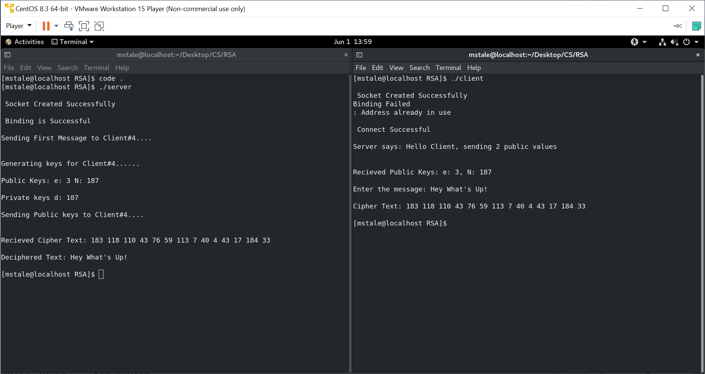

# RSA-Client-Server-SecureMessaging-in-C
RSA Client-Server Secure Messaging in C

# Installation
Make sure you have these libraries:
```
#include <sys/socket.h>
#include <netinet/in.h>
```
They are directly available on Linux, no need to install seperately

# Steps:
1. Change your IP Client and Server IP addresses:
```c++
clientinfo.sin_addr.s_addr = inet_addr("192.168.30.131");
```
```c++
srvinfo.sin_addr.s_addr = inet_addr("192.168.30.131");
```

2. Start a server on one terminal:
```bash
gcc server.c
```

3. Start a client on another terminal:
```bash
gcc client.c
```

# Example
